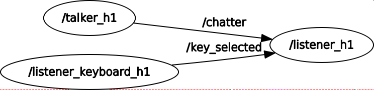

# First homework of Laboratorio Ciberfisico

## Description

The package homework1 contains three file written in C++.
These are based on ROS to realize three node.

The first node "talker_h1" publishes every second a message 'Persona', that contains
"nome" (string), "age" (uint8), "corso" (string).
The second one (listener_keyboard_h1) allows the user to select from keyboard which part of the message
to display on the screen.
The last one print the part of message filtered by user previously.

User can select to display:
* all fields of message 'persona' (digit 'a')
* only age (digit 'e')
* only course of studies (digit 'c')
* only name (digit 'n')


## Implementation

* The first node (talker_h1) publishes every second a message on "/chatter" topic.

* The second node (listener_keyboard_h1) listen the keyboard and when the user selected a key publish a message on
"key_selected" topic.

* The third node (listener_h1) listen the "/chatter" topic and the "key_selected" topic and use these information
to choose what part of message to display on the screen.

## Clone repository


```
git clone https://github.com/aleriboni/homework1.git
```

## Launch

The user can use homework1.launch to launch all nodes of the package.
This is a screenshot of the launcher:

```
roslaunch homework1 homework1.launch
```


This is the rqt_graph of the package:




## Framework

* [ROS](http://wiki.ros.org/)

## Author

* **Alessandro Riboni* - *official git repostory* - [aleriboni](https://github.com/aleriboni)

## License

This file is distributed under the terms of the GNU Lesser General Public License (Lesser GPL)

homework1 is distributed in the hope that it will be useful,
but WITHOUT ANY WARRANTY; without even the implied warranty of
MERCHANTABILITY or FITNESS FOR A PARTICULAR PURPOSE.  See the
GNU Lesser General Public License for more details.

You should have received a copy of the GNU Lesser General Public License
along with homework1. If not, see <http://www.gnu.org/licenses/>.

 [LICENSE](LICENSE)

Please, report suggestions/comments/bugs to<br>
alessandro.riboni@studenti.univr.it
